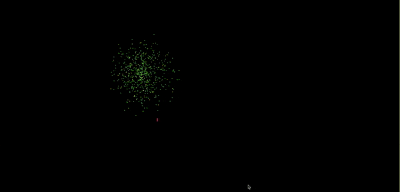

# Fireworks Simulation

🎆 **Live demo:**  
👉 https://melitasdsouza.github.io/cs44n-fireworks/

Fireworks simulation created for **CS 44N: Creative Coding** at Stanford.

Inspired by real-world fireworks physics and depth-based particle systems, this sketch simulates rocket launches and 3D spark explosions using perspective projection.

## Features
- Particle-based fireworks system
- Pseudo-3D depth projection (FOV-based scaling)
- Additive blending for glow effects
- Gravity-driven motion and lifetimes

## Inspiration
- Visual inspiration: https://www.youtube.com/watch?v=nzE8eUlseRM  
- Physics reference: https://www.forbes.com/sites/startswithabang/2016/07/01/the-physics-of-fireworks/

## Technologies
- JavaScript
- p5.js
